## What is an off ball run?

{fig-align="center"}

::: {.footer}
Cross receiver run example
:::

# Main Question
What characteristics of an off ball run are associated with higher offensive threat?

## Importance
- Players who increase offensive threat are an asset to their team
- Teams that exceed expected threat

## Data
2023 MLS Regular Season Event Data
- 520 matches
- 

  
  
Source:  
  

## Filtering
Originally, ~ 240,000 observations

- Dropped missing values in xthreat & speed average
- Dropped runs that are not in offensive half

Total remaining: ~ 170,000 obs for modeling

## Feature Engineering
::: columns
::: {.column width=55%}

:::

::: {.column width=45%}

- Condensed 10 run types into 5 groups
- Calculated x and y to goal distances 
  - x to goal $= 54.5 - x$
  - y to goal $= |y|$

:::
:::

## Features of Off Ball Runs
- Spatial baseline: Location on the field (x,y coordinates)
- Run characteristics: run type, average speed
- Space Creation: location to player in possession, distance to defensive line gain,
                  separation gain
- Game context: Game state, Number of simultaneous runs

## Beta Distribution
::: columns
::: {.column width="40%"}
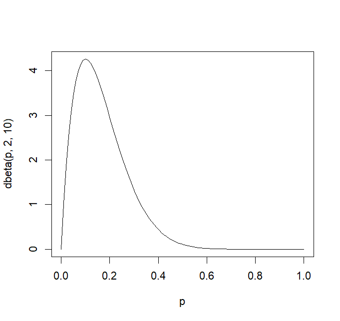
:::
::: {.column width="60%"}
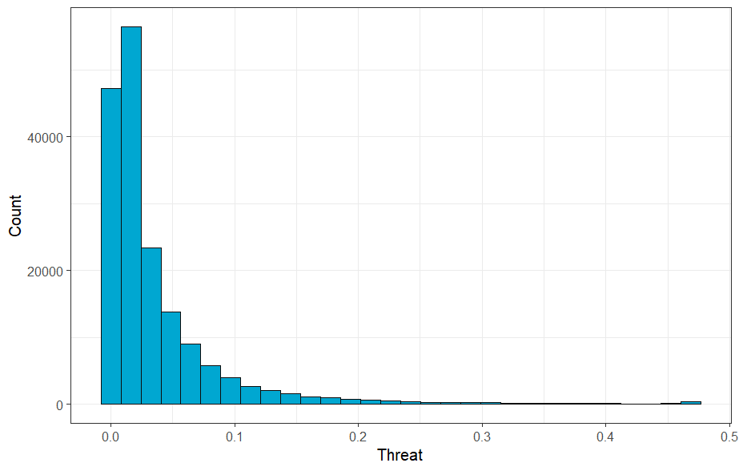
:::
:::

Used for proportion data (0,1)

## Beta GLM Regression
::: {.incremental}
Models - 5 fold cross validation

 - baseline using (x,y) distances to goal
 - baseline + run characteristics
 - baseline + run characteristics + spatial features
 - baseline + run characteristics + spatial features + game context
 
:::

. . . 

Best perfomer: Full Model

## Linear model using log(Xthreat)
::: columns
::: {.column width="45%"}
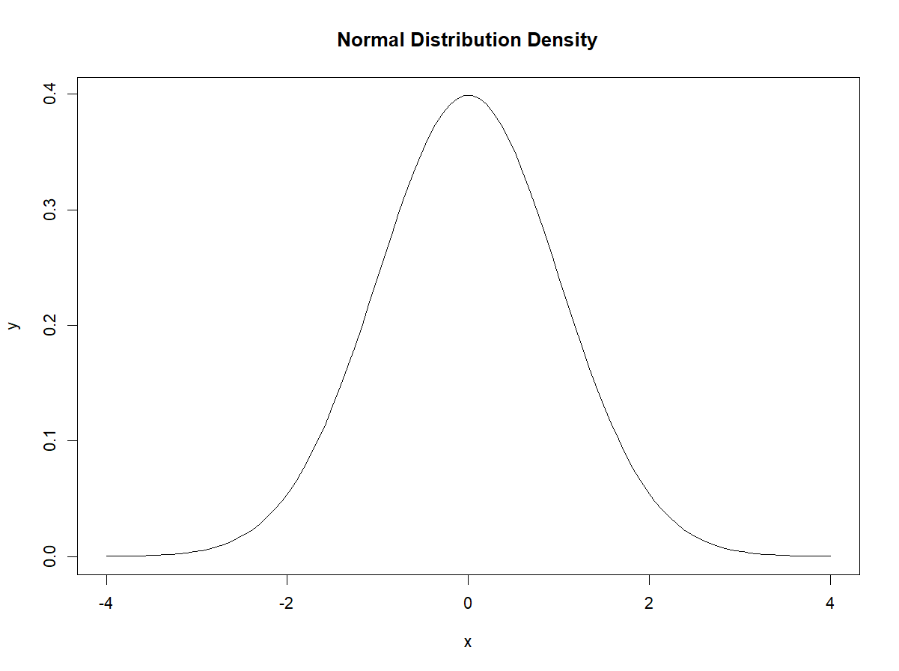
:::
::: {.column width=55%}
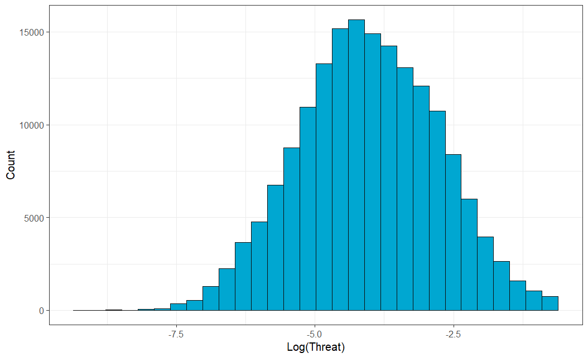
:::

:::

Linear performed worse than beta model in 5-fold CV

## Beta GLM vs Beta GAM
GAM model accounts for more flexibility 

## Choosing the best model
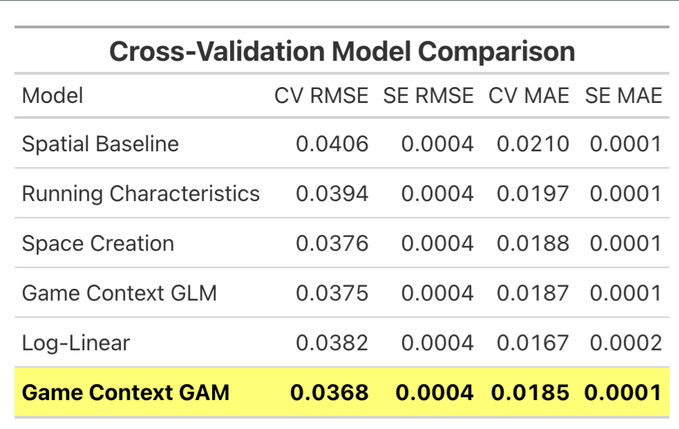{fig-align="center"}

# Inference

## Smooth Terms
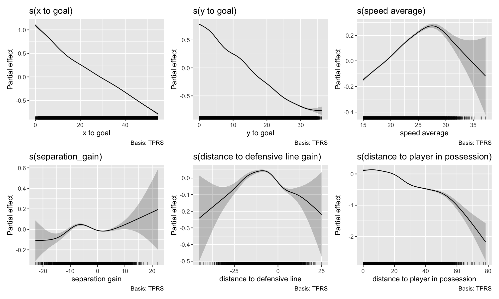{fig-align="center"}

## Parametric Terms
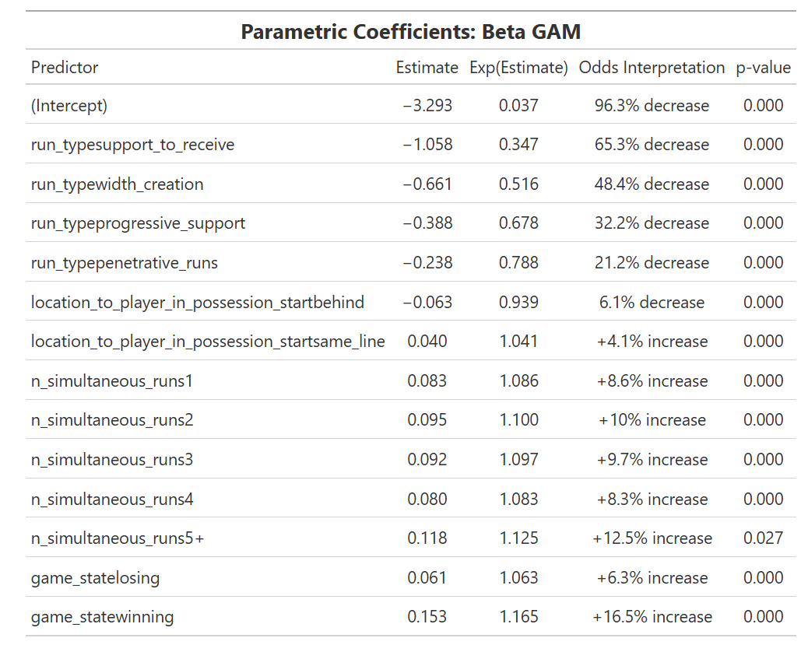{fig-align="center"}

## Threat Generation Metrics
$xTOE = (residual) / (expected)$

## Player Threat
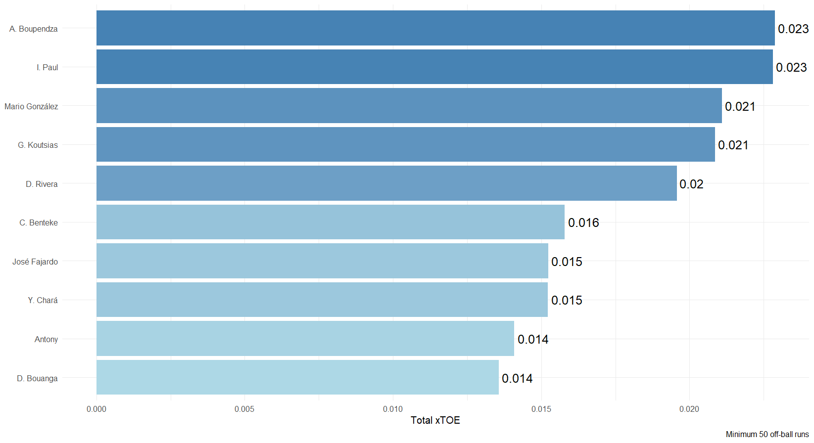

## Team Threat
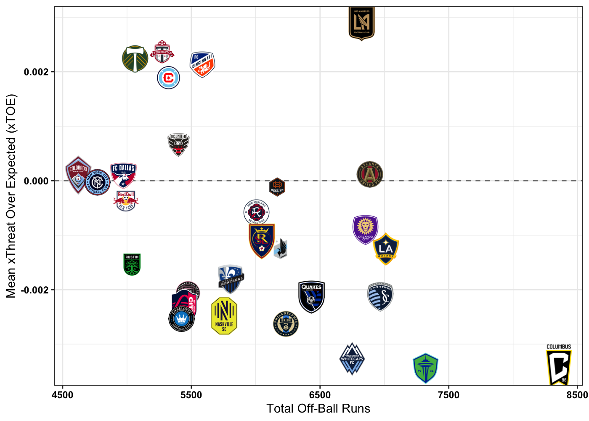{fig-align="center"}

## Conclusions
Write conclusions here

## Discussions

**Limitations**

- Our model is dependent on their xthreat model
- Xthreat is not a robust measure of run effectiveness
- Only looking at one season of data

. . . 

**Future Work**

- Adding SkillCorner's tracking data
- Compare our best model to an XGBoost model to see if there is more hidden flexibility

# Appendix

## Off Ball Run Definition
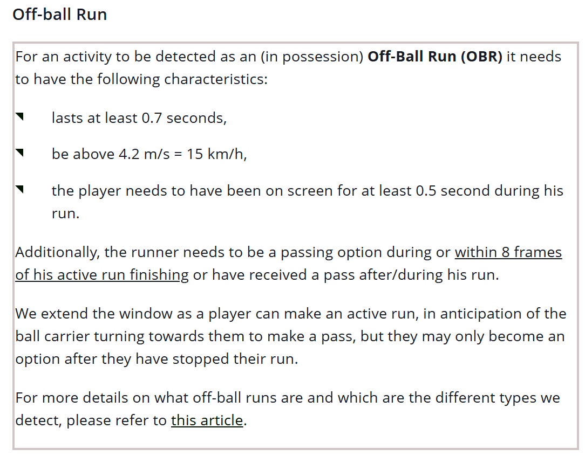{fig-align="center"}

::: {.footer}
Source: (https://skillcorner.crunch.help/en/glossaries/off-ball-run-dynamic-events)
:::

## Xthreat definition
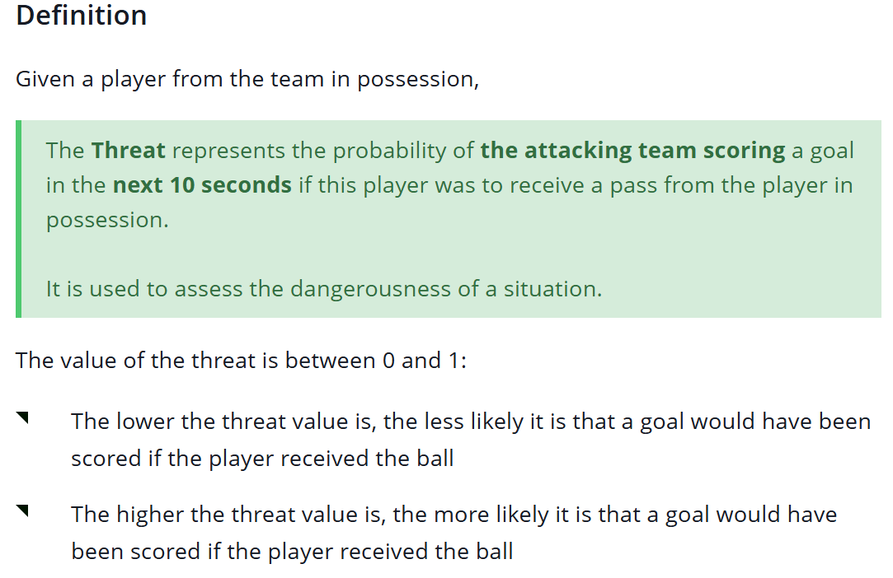

::: {.footer}

Definition taken from [Xthreat definition](https://skillcorner.crunch.help/en/models-general-concepts/threat)

All variable descriptions available at [this link](https://26560301.fs1.hubspotusercontent-eu1.net/hubfs/26560301/Guides/Dynamic%20Events/20260223%20-%20Dynamic%20Events%20CSV%20Specifications.pdf)

:::

## Run Type Categories
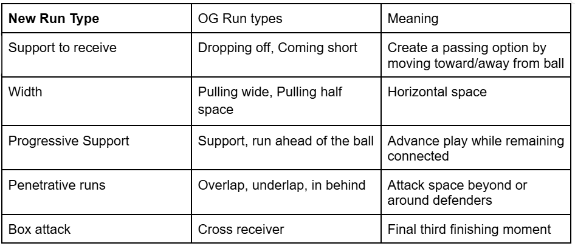

## Things to Do to fix these slides
- Add Charlotte FC logo on title page
- include importance