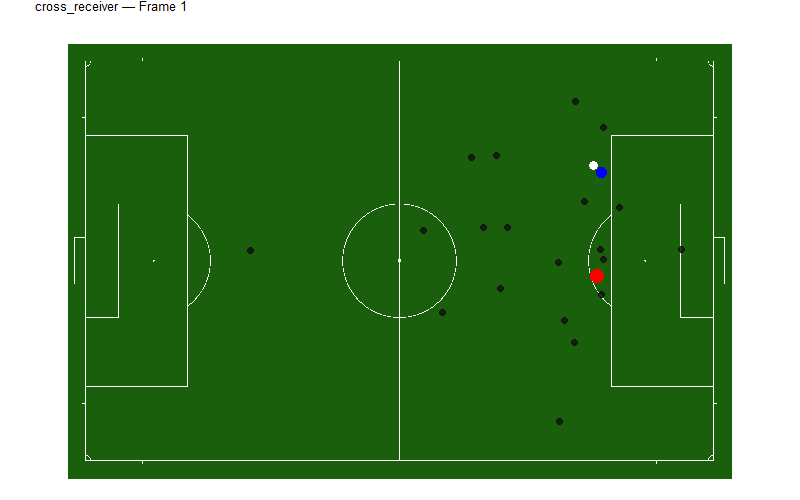
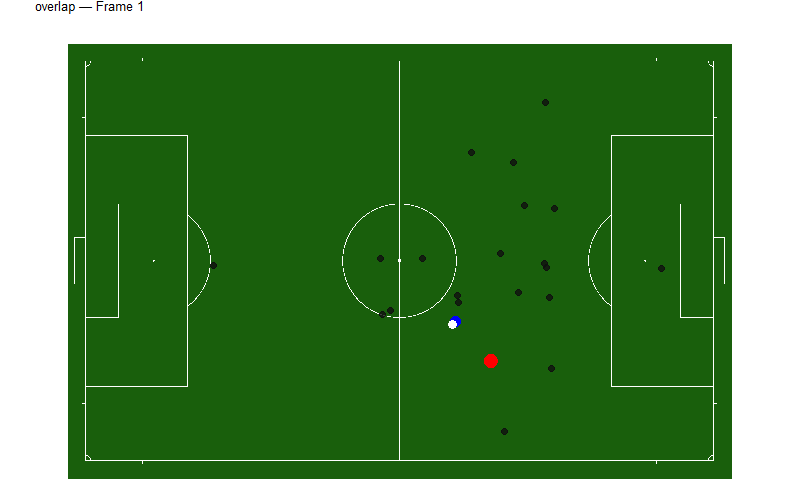

## What is an off ball run?
Definition: An off ball run is...


::: {.panel-tabset}

### Cross Receiver Run
{width=70%}

### Run Ahead of the Ball
{width=70%}

### Support
{width=70%}

### Pulling Wide
{width=70%}

### Overlap
{width=70%}

### Underlap
{width=70%}

### Third-Man Run
{width=70%}

### Blindside Run
{width=70%}

### Depth Run
{width=70%}

:::


## Main Question
What characteristics of an off ball run are associated with higher offensive threat?

## Data
2023 MLS Regular Season Event Data

Source: SkillCorner


## Threat - Calculated by SkillCorner


## EDA plot
How is xthreat distributed among run types

## Features of Off Ball Runs
- Location on the field (x,y coordinates)
- Run characteristics: run type, average speed
- Spatial features: distance to player in possession, 
- Game context: Game state, Number of simultaneous runs

## Beta Regression
used for proportion response variable (0,1)


Models


 - baseline using (x,y) coordinates
 - baseline + run characteristics
 - baseline + run characteristics + spatial features
 - baseline + run characteristics + spatial features + game context


## Choosing the best model
Cross validation between beta models
Beta model vs linear model that uses a log transform


## Inference
These characteristics are the most important


## Limitations
A lot of data to work with
Our model has to trust how well their xthreat model is calculated

## Future Work
- Adding SkillCorner's tracking data
- GAM model


## Appendix

## SkillCorner descriptions
screenshot skillcorner descriptions for our variables


## Quarto

Quarto enables you to weave together content and executable code into a finished presentation. To learn more about Quarto presentations see <https://quarto.org/docs/presentations/>.

## Bullets

When you click the **Render** button a document will be generated that includes:

- Content authored with markdown
- Output from executable code

## Code

When you click the **Render** button a presentation will be generated that includes both content and the output of embedded code. You can embed code like this:

```{r}
1 + 1
```

## Things to Do to fix these slides
- Add Charlotte FC logo on title page
- Maybe add SkillCorner logo on data slide